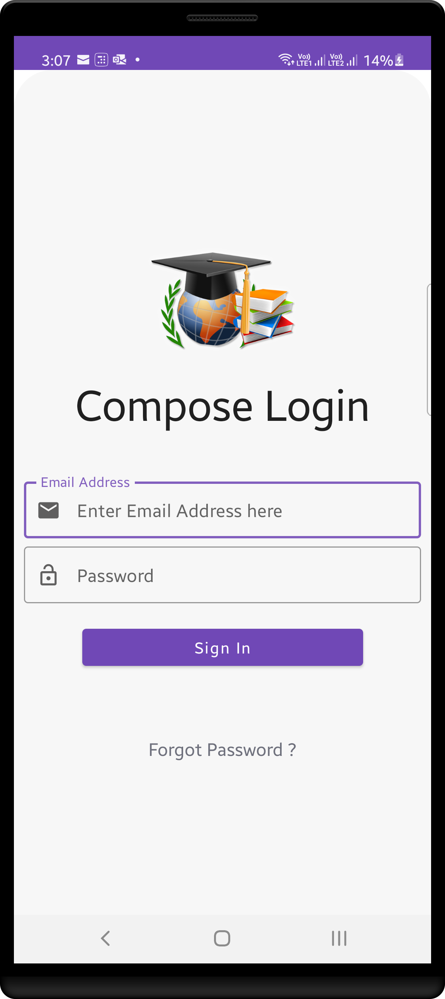

# JetpackComposeDemo
Android Demo Application for Jetpack Compose UI ( Simple Login Screen )

## Screenshots 

### Used Tech
* [Kotlin](https://kotlinlang.org/)
* [MVVM](https://developer.android.com/jetpack/docs/guide)
* [Compose](https://developer.android.com/jetpack/compose) - Modern toolkit for building native UI.
* [Coroutines](https://kotlinlang.org/docs/reference/coroutines-overview.html) - Provide sophisticated tools to handle concurrency.
* [ViewModel](https://developer.android.com/topic/libraries/architecture/viewmodel) - Store UI-related data that isn't destroyed on app rotations. Easily schedule asynchronous tasks.
* [MutableState](https://developer.android.com/reference/kotlin/androidx/compose/runtime/MutableState) - A mutable value holder.

